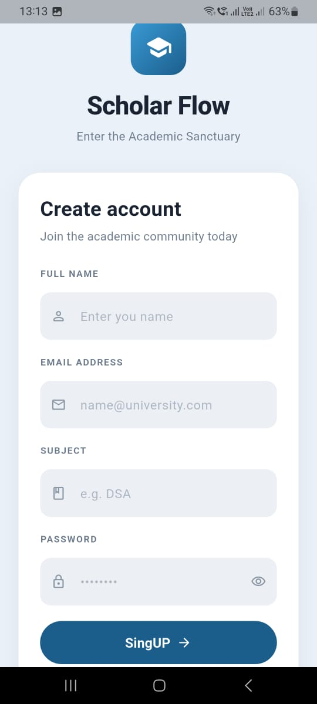

<div align="center">


# 🎓 Scholar Flow

### *Streamlining Academic Workflows for Modern Students*

[](https://flutter.dev)
[](https://dart.dev)
[](https://firebase.google.com)
[](https://cloudinary.com)
[](LICENSE)
[](CONTRIBUTING.md)

<br/>

**Scholar Flow** is a full-featured, cross-platform mobile application built with Flutter that digitizes and simplifies the end-to-end academic workflow — from student enrollment and attendance tracking to performance analytics and marks management.

[Features](#-features) · [Tech Stack](#️-tech-stack) · [Screenshots](#-screenshots) · [Getting Started](#-getting-started) · [Architecture](#-architecture) · [Contributing](#-contributing)

</div>

---

## 📖 Overview

Scholar Flow eliminates paper-based academic processes by providing educators and students with a unified digital platform. Built using **Flutter** for seamless cross-platform performance, the app integrates **Firebase** for authentication and real-time data, **Cloudinary** for optimized media storage, and **REST APIs** for dynamic content management — all following clean architecture principles.

Whether you're tracking daily attendance, recording exam marks, or analyzing student performance trends, Scholar Flow delivers a fast, reliable, and intuitive experience on both Android and iOS.

---

## ✨ Features

| Feature | Description |
|---|---|
| 🔐 **Authentication** | Secure sign-in and sign-up via Firebase Authentication |
| 🏠 **Dashboard** | Centralized home screen with quick access to all modules |
| 👤 **Student Management** | Add, view, and manage student profiles with ease |
| 📝 **Attendance Tracking** | Mark and review daily attendance records per class |
| 📊 **Marks Entry** | Record subject-wise marks for assessments and exams |
| 📈 **Performance Analytics** | Visual performance summaries and trend insights per student |
| 🖼️ **Media Uploads** | Cloudinary-powered image uploads, optimized and cost-efficient |
| 🔄 **Real-time Sync** | Live data updates via Firebase Firestore |
| 📱 **Responsive Design** | Pixel-perfect UI across all screen sizes |
| 🎨 **Clean Modern UI** | Thoughtfully designed interface focused on usability |

---

## 🛠️ Tech Stack

```
Scholar Flow
├── Frontend        →  Flutter (Dart)
├── State Mgmt      →  Provider
├── Authentication  →  Firebase Auth
├── Database        →  Cloud Firestore (Firebase)
├── Media Storage   →  Cloudinary
└── Data Layer      →  REST APIs
```

| Technology | Purpose | Version |
|---|---|---|
| [Flutter](https://flutter.dev) | Cross-platform UI framework | 3.x |
| [Dart](https://dart.dev) | Programming language | 3.x |
| [Firebase Auth](https://firebase.google.com/products/auth) | User authentication | Latest |
| [Cloud Firestore](https://firebase.google.com/products/firestore) | NoSQL real-time database | Latest |
| [Cloudinary](https://cloudinary.com) | Image storage & optimization | Latest |
| [Provider](https://pub.dev/packages/provider) | State management | ^6.x |

---

## 📸 Screenshots

### 🔐 Authentication

<table cellpadding="12">
  <tr>
    <td align="center"><b>Sign In</b></td>
    <td align="center"><b>Sign Up</b></td>
  </tr>
  <tr>
    <td align="center">
      
    </td>
    <td align="center">
      
    </td>
  </tr>
</table>

### 🏠 Dashboard & Marks

<table cellpadding="12">
  <tr>
    <td align="center"><b>Homepage</b></td>
    <td align="center"><b>Enter Marks</b></td>
  </tr>
  <tr>
    <td align="center">
      
    </td>
    <td align="center">
      
    </td>
  </tr>
</table>

### 👤 Student Management & Attendance

<table cellpadding="12">
  <tr>
    <td align="center"><b>Add New Student</b></td>
    <td align="center"><b>Attendance Page</b></td>
  </tr>
  <tr>
    <td align="center">
      
    </td>
    <td align="center">
      
    </td>
  </tr>
</table>

### 📈 Performance Analytics

<table cellpadding="12">
  <tr>
    <td align="center"><b>Performance Overview</b></td>
    <td align="center"><b>Detailed Performance</b></td>
  </tr>
  <tr>
    <td align="center">
      
    </td>
    <td align="center">
      
    </td>
  </tr>
</table>

---

## 🚀 Getting Started

### Prerequisites

Ensure you have the following installed before proceeding:

- [Flutter SDK](https://docs.flutter.dev/get-started/install) (v3.x or above)
- [Dart SDK](https://dart.dev/get-dart) (v3.x or above)
- [Android Studio](https://developer.android.com/studio) or [VS Code](https://code.visualstudio.com/) with Flutter plugin
- A Firebase project with Auth & Firestore enabled
- A [Cloudinary](https://cloudinary.com) account

### Installation

1. **Clone the repository**

   ```bash
   git clone https://github.com/your-username/scholar-flow.git
   cd scholar-flow
   ```

2. **Install dependencies**

   ```bash
   flutter pub get
   ```

3. **Configure Firebase**

   - Create a project at [Firebase Console](https://console.firebase.google.com/)
   - Enable **Authentication** (Email/Password) and **Cloud Firestore**
   - Download `google-services.json` (Android) and `GoogleService-Info.plist` (iOS)
   - Place them in the respective platform folders:
     - `android/app/google-services.json`
     - `ios/Runner/GoogleService-Info.plist`

4. **Configure Cloudinary**

   Create a `.env` file in the project root (or update `lib/config/app_config.dart`):

   ```env
   CLOUDINARY_CLOUD_NAME=your_cloud_name
   CLOUDINARY_API_KEY=your_api_key
   CLOUDINARY_API_SECRET=your_api_secret
   ```

5. **Run the app**

   ```bash
   flutter run
   ```

---

## 🏗️ Architecture

Scholar Flow follows a **layered clean architecture** pattern to ensure separation of concerns, scalability, and testability.

```
lib/
├── config/             # App configuration & constants
├── core/
│   ├── errors/         # Failure & exception classes
│   ├── utils/          # Helper functions & extensions
│   └── widgets/        # Shared/reusable UI components
├── data/
│   ├── models/         # Data models & DTOs
│   ├── repositories/   # Repository implementations
│   └── services/       # Firebase, Cloudinary, API services
├── domain/
│   ├── entities/       # Core business entities
│   └── repositories/   # Abstract repository contracts
├── presentation/
│   ├── providers/      # Provider state management
│   ├── screens/        # Feature screens
│   └── widgets/        # Feature-specific widgets
└── main.dart
```

---

## 📦 Key Dependencies

```yaml
dependencies:
  flutter:
    sdk: flutter
  firebase_core: ^2.x
  firebase_auth: ^4.x
  cloud_firestore: ^4.x
  provider: ^6.x
  http: ^1.x
  cloudinary_public: ^0.x
  cached_network_image: ^3.x
  image_picker: ^1.x
  flutter_dotenv: ^5.x
```

> See [`pubspec.yaml`](pubspec.yaml) for the complete list.

---

## 🔐 Environment Variables

| Variable | Description |
|---|---|
| `CLOUDINARY_CLOUD_NAME` | Your Cloudinary cloud name |
| `CLOUDINARY_API_KEY` | Cloudinary API key |
| `CLOUDINARY_API_SECRET` | Cloudinary API secret |

> ⚠️ Never commit your `.env` file or API keys to version control. Add `.env` to `.gitignore`.

---

## 🤝 Contributing

Contributions are always welcome! Here's how to get started:

1. **Fork** the repository
2. **Create** a feature branch: `git checkout -b feature/your-feature-name`
3. **Commit** your changes: `git commit -m 'feat: add your feature'`
4. **Push** to the branch: `git push origin feature/your-feature-name`
5. **Open** a Pull Request

Please follow the [Conventional Commits](https://www.conventionalcommits.org/) specification for commit messages.

---

## 🐛 Bug Reports & Feature Requests

Found a bug or have an idea? [Open an issue](https://github.com/your-username/scholar-flow/issues) with:
- A clear and descriptive title
- Steps to reproduce (for bugs)
- Expected vs. actual behavior
- Screenshots if applicable

---

## 📄 License

This project is licensed under the **MIT License** — see the [LICENSE](LICENSE) file for details.

---

## 👨‍💻 Author

<div align="center">

**Your Name**

[](https://github.com/your-username)
[](https://linkedin.com/in/your-profile)

*If you found this project helpful, please consider giving it a ⭐*

</div>

---

<div align="center">

Made with ❤️ using Flutter

</div>