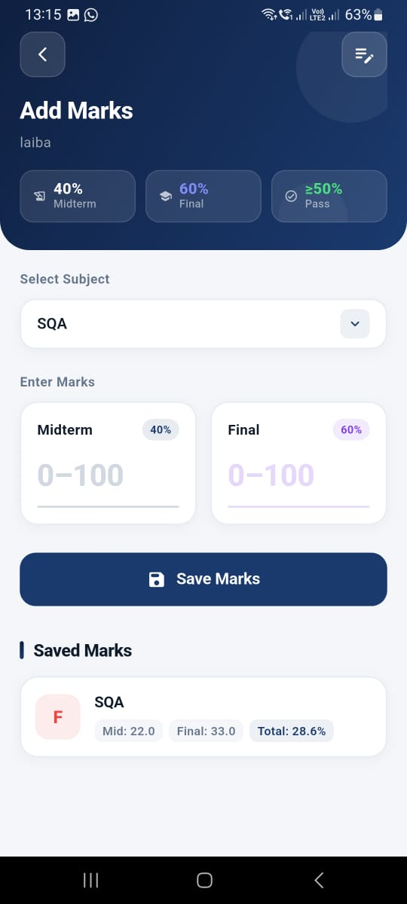
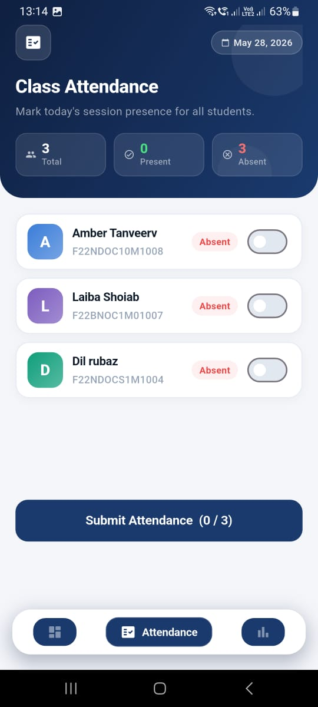
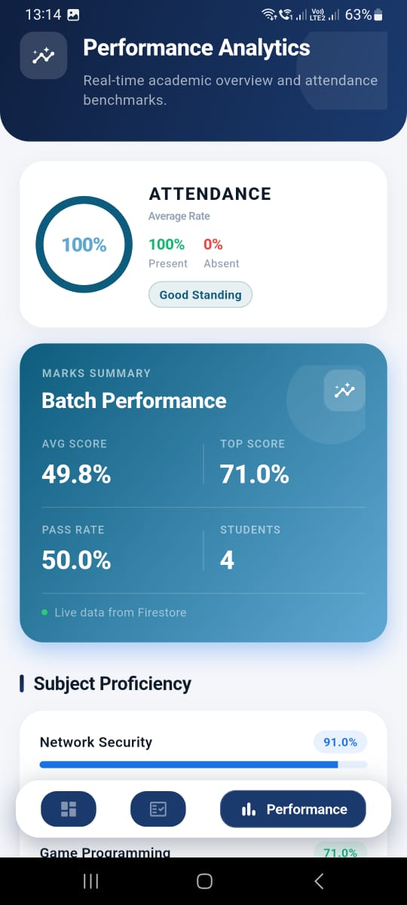

# 📱 Scholar Flow – Flutter Mobile Application

## 📘 Scholar Flow

Scholar Flow is a full-featured Flutter-based mobile application developed to simplify and digitize the academic workflow for students. The app focuses on providing a smooth and intuitive user experience while handling core academic activities such as authentication, content management, and data interaction in a secure and scalable manner.

The application is built using **Flutter** for cross-platform performance and integrates **Firebase** services for authentication and real-time database operations. To efficiently handle media uploads and reduce backend costs, **Cloudinary** is used for image storage instead of Firebase Storage. Scholar Flow also consumes **REST APIs** to fetch and manage dynamic data, following clean architecture principles 

---

## 🚀 Features
- Clean & modern UI
- Firebase Authentication
- REST API Integration
- Cloudinary for image storage
- Real-time data handling
- Responsive design

---

## 🛠️ Tech Stack
- **Flutter (Dart)**
- **Firebase (Auth, Firestore)**
- **REST APIs**
- **Cloudinary**
- **Provider (State Management)**

---

📸 App Screenshots
#🔐 SigIn & 🏠 SignUP
<table cellpadding="12"> <tr> <td align="center"><b>🔐 SigIn Page</b></td> <td align="center"><b>🏠 SignUP</b></td> </tr> <tr> <td align="center">  </td> <td align="center">  </td> </tr> </table>  
#✂️ Homepage 
<table cellpadding="12"> <tr> <td align="center"><b>✂️ Homepage</b></td> <td align="center"><b>📦 Enter Marks</b></td> </tr> <tr> <td align="center">  </td> <td align="center">  </td> </tr> </table>  
#👤 Add New Student & 📝 Attendance Page
<table cellpadding="12"> <tr> <td align="center"><b>👤 Add New Student</b></td> <td align="center"><b>📝 Attendance Page</b></td> </tr> <tr> <td align="center">  </td> <td align="center">  </td> </tr> </table>  
#🧑‍💼 Attendance Page
<table cellpadding="12"> <tr> <td align="center"><b>🧑‍💼 Performance page</b></td> <td align="center"><b>📋 Performance Page</b></td> </tr> <tr> <td align="center">  </td> <td align="center">  </td> </tr> </table>

